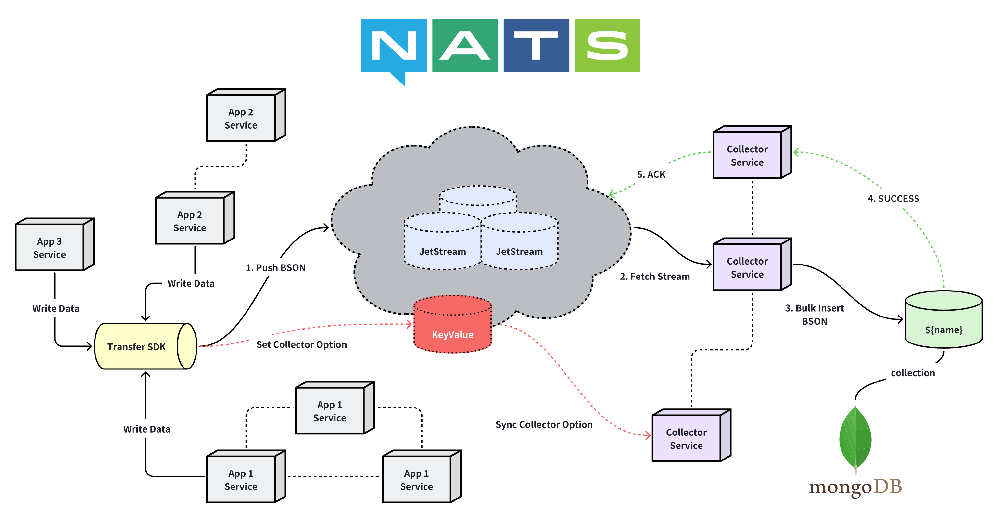

# Collector

[](https://github.com/kainonly/collector/actions/workflows/release.yml)
[](https://github.com/kainonly/collector/releases)
[](https://github.com/kainonly/collector)
[](https://goreportcard.com/report/github.com/kainonly/collector)
[](https://raw.githubusercontent.com/kainonly/collector/main/LICENSE)

English | [简体中文](README_zh-CN.md)

A lightweight service for collecting and persisting time-series data. It consumes BSON payloads from NATS JetStream work-queue streams and batch writes them to MongoDB.

## Overview



## Features

- Push-based message consumption from NATS JetStream
- Batch writes to MongoDB with configurable buffer
- Dynamic stream management via JetStream KeyValue
- Auto-subscribe on KV PUT, auto-unsubscribe on KV DELETE
- Graceful shutdown with final buffer flush
- Cloud-native design: multiple streams per collector, scale horizontally

## Prerequisites

- NATS JetStream cluster
- MongoDB 5.0+

## Configuration

Create `config/values.yml`:

```yaml
mode: debug
namespace: alpha
batch_size: 1000
flush_interval: 5s
nats_hosts:
  - nats://127.0.0.1:4222
nats_token: your-token
mongo_url: mongodb://localhost:27017
mongo_database: example
```

| Field | Description |
|-------|-------------|
| `mode` | `debug` or `release` |
| `namespace` | Application namespace for stream/KV naming |
| `batch_size` | Flush buffer when reaching this count |
| `flush_interval` | Flush buffer at this interval |
| `nats_hosts` | NATS server addresses |
| `nats_token` | NATS authentication token |
| `mongo_url` | MongoDB connection URL |
| `mongo_database` | MongoDB database name |

## Data Flow

```
┌─────────────┐     ┌─────────────┐     ┌─────────────┐
│ App Service │     │ App Service │     │ App Service │
└──────┬──────┘     └──────┬──────┘     └──────┬──────┘
       │                   │                   │
       └───────────────────┼───────────────────┘
                           │ Send BSON
                           ▼
                  ┌─────────────────┐
                  │  Transfer SDK   │
                  │  Publish BSON   │
                  └────────┬────────┘
                           │
                           ▼
┌─────────────────────────────────────────────────────────────┐
│                     NATS JetStream                          │
│  Stream: {namespace}_{key}                                  │
│  Subject: {namespace}.{key}                                 │
│  Consumer: default (WorkQueue)                              │
│  KV Bucket: {namespace}                                     │
└───────────────────────────┬─────────────────────────────────┘
                            │ Consume()
                            ▼
┌─────────────────────────────────────────────────────────────┐
│                    Collector Pod                            │
│                                                             │
│   Message ──► Buffer ──► Flush ──► InsertMany               │
│                 │                                           │
│         (batch_size OR flush_interval)                      │
└───────────────────────────┬─────────────────────────────────┘
                            │ Success: ACK / Fail: NAK
                            ▼
                  ┌─────────────────────────┐
                  │        MongoDB          │
                  └─────────────────────────┘
```

## Transfer SDK

Client SDK for managing streams and publishing BSON payloads.

```go
import (
    "context"
    "time"

    "github.com/kainonly/collector/v3/transfer"
    "github.com/nats-io/nats.go"
    "go.mongodb.org/mongo-driver/v2/bson"
)

func main() {
    ctx := context.Background()
    nc, _ := nats.Connect("nats://127.0.0.1:4222", nats.Token("your-token"))

    // Create client
    t, _ := transfer.New(ctx, "alpha", nc)

    // Register stream
    t.Add(ctx, transfer.Option{
        Key:         "metrics",
        Collection:  "metrics",
        Description: "Metrics stream",
    })

    // Publish BSON data
    t.Send("metrics", bson.M{
        "ts":  time.Now(),
        "cpu": 0.42,
    })

    // Query collector state
    option, _ := t.Get(ctx, "metrics")
    fmt.Println(option.BufferSize)

    // Remove stream
    t.Remove(ctx, "metrics")
}
```

## Quick Start

```bash
cp config/values.example.yml config/values.yml
go run .
```

## Deploy

Container image: `ghcr.io/kainonly/collector:latest`

Kubernetes deployment example:

```yaml
apiVersion: apps/v1
kind: Deployment
metadata:
  name: collector
spec:
  selector:
    matchLabels:
      app: collector
  template:
    metadata:
      labels:
        app: collector
    spec:
      containers:
        - name: collector
          image: ghcr.io/kainonly/collector:latest
          imagePullPolicy: Always
          volumeMounts:
            - name: config
              mountPath: /app/config
      volumes:
        - name: config
          configMap:
            name: collector-config
```

## Project Layout

- `main.go` - Entry point
- `bootstrap/` - Configuration and dependency setup
- `app/` - Collector runtime (KV watch, buffer, MongoDB writes)
- `transfer/` - Producer SDK (stream/KV management + publish)
- `common/` - Shared types and logger
- `config/` - Configuration examples

## License

[BSD-3-Clause License](LICENSE)
